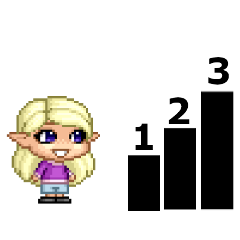

# Pixel-Quest
## a Small Java Game with Interface 

## Play throw
You spawn on a Small Map as a Charakter with Coins around you.  
Your Goal is To Collect all 5 Coins on Screen.  

## Move around
You Control your Charakter with the keys: UP, DOWN, LEFT, RIGHT
You get a Small Text in the Top Left Coner where you Total Coins are Collectet  

## Level System
you collect all Coins on the map, to complett a level.
You gain more speed and more available coins  

## Developer:
- Paul Merget  
- Charakter Model: https://www.avatarsinpixels.com/

